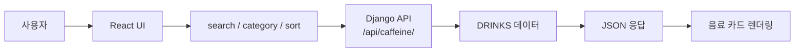

# Today's Caffeine

> 시험기간에 마실 카페인 음료를 검색, 필터, 정렬해서 비교하는 Django + React 웹 서비스


## Overview

Today's Caffeine은 시험기간에 필요한 카페인 음료를 빠르게 비교하기 위한 서비스입니다.  
커피, 에너지드링크, 차/기타 음료를 대상으로 카페인 함량, 가격, 맛 태그, 추천 상황을 확인할 수 있습니다.

```txt
검색어 입력 → 카테고리 선택 → 정렬 기준 선택 → 백엔드 API 호출 → 음료 카드 렌더링
```

## Features

| 기능           | 설명                                                     |
| -------------- | -------------------------------------------------------- |
| 음료 목록 조회 | `views.py`의 음료 데이터를 JSON으로 조회                 |
| 키워드 검색    | 음료명, 브랜드, 맛 태그, 추천 상황 기준 검색             |
| 카테고리 필터  | 커피, 에너지드링크, 차/기타 기준 필터링                  |
| 정렬           | 총 카페인, 가격, 카페인 밀도 기준 오름차순/내림차순 정렬 |
| API 연동       | React에서 Django API를 fetch로 호출                      |
| 배포 준비      | Railway backend, Vercel frontend 배포 설정 정리          |

## Service Flow



## Tech Stack

| 영역       | 기술                                          |
| ---------- | --------------------------------------------- |
| Backend    | Python, Django, django-cors-headers, gunicorn |
| Frontend   | React, TypeScript, Vite                       |
| Deployment | Railway, Vercel                               |
| Data       | Django `views.py` 내부 리스트/딕셔너리 데이터 |

## Team Roles

| 담당   | 역할                               |
| ------ | ---------------------------------- |
| 박소정 | 백엔드 API 구현, API 명세서 작성   |
| 권태열 | 프론트 UI, 컴포넌트 구현           |
| 김희성 | 프론트 API 연동, 배포, README 작성 |

## Directory Structure

```txt
todays-caffeine/
├── backend/
│   ├── API_SPEC.md
│   ├── Procfile
│   ├── manage.py
│   ├── requirements.txt
│   ├── main/
│   │   ├── urls.py
│   │   └── views.py
│   └── mysite/
│       ├── settings.py
│       └── urls.py
└── frontend/
    ├── .env.example
    ├── package.json
    └── src/
        ├── api/
        ├── types/
        ├── App.tsx
        ├── CaffeineCard.tsx
        └── SearchFilter.tsx
```

## Quick Start

### 1. Backend

```bash
cd backend
venv\Scripts\activate
pip install -r requirements.txt
python manage.py runserver
```

| 항목         | URL                                 |
| ------------ | ----------------------------------- |
| Django       | http://127.0.0.1:8000               |
| Caffeine API | http://127.0.0.1:8000/api/caffeine/ |

### 2. Frontend

```bash
cd frontend
npm install
npm.cmd run dev
```

| 항목  | URL                   |
| ----- | --------------------- |
| React | http://localhost:5173 |

PowerShell에서 `npm` 실행 정책 오류가 나면 `npm.cmd`를 사용합니다.

## Environment Variables

`frontend/.env.example`을 참고해 `frontend/.env`를 만들 수 있습니다.

```env
VITE_API_BASE_URL=http://127.0.0.1:8000
```

로컬에서는 기본값이 `http://127.0.0.1:8000`으로 설정되어 있어 `.env` 없이도 동작합니다.

## API

자세한 API 명세는 [backend/API_SPEC.md](backend/API_SPEC.md)를 참고합니다.

### Endpoint

```txt
GET /api/caffeine/
```

### Query Parameters

| 이름       | 설명                               | 예시              |
| ---------- | ---------------------------------- | ----------------- |
| `search`   | 음료명, 브랜드, 맛, 추천 상황 검색 | `?search=달달`    |
| `category` | 카테고리 필터                      | `?category=커피`  |
| `sort`     | 정렬 기준                          | `?sort=price_low` |

### Sort Values

| 값              | 설명                      |
| --------------- | ------------------------- |
| `caffeine_high` | 총 카페인 높은 순         |
| `caffeine_low`  | 총 카페인 낮은 순         |
| `price_high`    | 가격 높은 순              |
| `price_low`     | 가격 낮은 순              |
| `density_high`  | 100ml 기준 카페인 높은 순 |
| `density_low`   | 100ml 기준 카페인 낮은 순 |

### Request Examples

```txt
GET http://127.0.0.1:8000/api/caffeine/?search=red
GET http://127.0.0.1:8000/api/caffeine/?category=커피
GET http://127.0.0.1:8000/api/caffeine/?sort=caffeine_high
```

### Response Example

```json
[
  {
    "id": 1,
    "name": "레드불 오리지날",
    "brand": "Red Bull",
    "category": "에너지드링크",
    "volume_ml": 250,
    "caffeine_per_100ml": 25,
    "price": 1500,
    "recommend_tags": ["벼락치기", "졸릴 때"],
    "flavor_tags": ["달달한 맛"],
    "caffeine_total": 62
  }
]
```

## Verification

Backend:

```bash
cd backend
venv\Scripts\activate
python manage.py check
```

Frontend:

```bash
cd frontend
npm.cmd run lint
npm.cmd run build
```

## Deployment

### Railway Backend

Railway에서 GitHub 저장소를 연결한 뒤 `backend`를 기준으로 배포합니다.

```txt
Root Directory: backend
Start Command: gunicorn mysite.wsgi --bind 0.0.0.0:$PORT
```

환경변수:

```env
SECRET_KEY=배포용_시크릿키
DEBUG=False
ALLOWED_HOSTS=your-railway-domain.up.railway.app
CORS_ALLOWED_ORIGINS=https://your-vercel-domain.vercel.app
```

### Vercel Frontend

Vercel에서 `frontend`를 기준으로 배포합니다.

환경변수:

```env
VITE_API_BASE_URL=https://your-railway-domain.up.railway.app
```

배포 후 Railway의 `CORS_ALLOWED_ORIGINS`에 Vercel 도메인을 추가해야 합니다.
